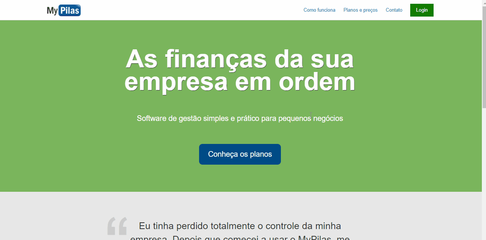
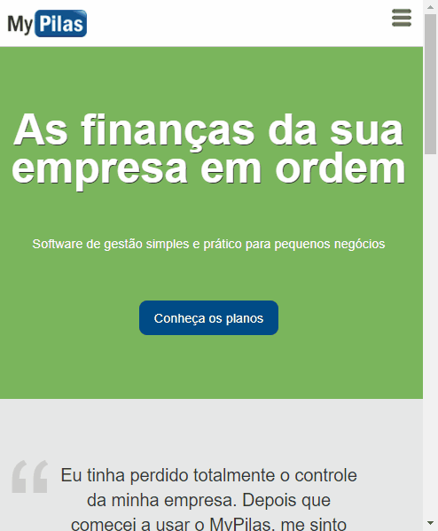

# Web Design Responsivo com HTML5, CSS3 e BEM da Algaworks

Descrição: Aprenda a criar páginas web responsivas do zero e com uma metodologia que possibilite escalar o seu código.

Link: 🔗[Curso Web Design Responsivo com HTML5, CSS3 e BEM by Algaworks](https://www.algaworks.com/curso/web-design-responsivo-html5-css3-bem)

## 💻 Projeto do curso

  

MyPilas - Projeto de landing page para oferecimento de um produto (MyPilas). A landing page é composta de menu, chamada principal, depoimentos, planos e rodpé. Envolveu a implementação de uma landing page, formulário e tabela de forma responsiva e adaptável a diversos tamanhos de telas.

## :camera: Demonstração

## :rocket: Conceitos e tecnologias

✔️ HTML e CSS

✔️ Reset CSS e Normalize.css

✔️ CSS Guidelines

✔️ Bootstrap

✔️ Web Design Responsivo

✔️ Especificidade, BEM e boas práticas

✔️ JavaScript Hook

✔️ Tabelas

✔️ Chrome DevTools

## :phone: Contato

 Linkedin [https://www.linkedin.com/in/danyllo-valente-da-silva-3569b460](https://www.linkedin.com/in/danyllo-valente-da-silva-3569b460)

:postbox: E-mail [danyllo.dvs@gmail.com](danyllo.dvs@gmail.com)
